# 抖音小说小程序【模仿“谜鹿小说”】（抖音在线读物小程序，支持巨量投放平台）
### 【我们有小说合作渠道|有网络出版权限】
### 后台展示

    后台主要采用PHP的laravel框架开发，页面采用的是antd Pro开发，后台主要涉及到以下模块：

    1.小说管理：主要是小说的分类标签，以及小说的管理、小说的评论管理等
    2.会员管理：小程序的会员管理系统，能查看会员的注册时间以及充值金额、当前余额、会员到期时间等等
    3.费用管理：涉及会员的充值以及每个小说对应章节的付费（目前系统支持会员体系和书币体系，两者可以兼容）
    4.提现管理：主要是分享口令，带来收益，用户可以进行提现
    5.小程序管理：主要是小程序的设置，比如“小程序首页结构”等
    6.回传管理：主要针对“巨量”广告平台开发的手动回传，进行转化的计算
    7.数据统计：主要是每日、每周、每月的消费数据和充值等数据，带有折线图
    8.公告管理：小程序用户可以看到的公告
    9.角色管理：支持系统多角色管理
    10.系统设置：比如“小程序用户的默认头像”设置等等

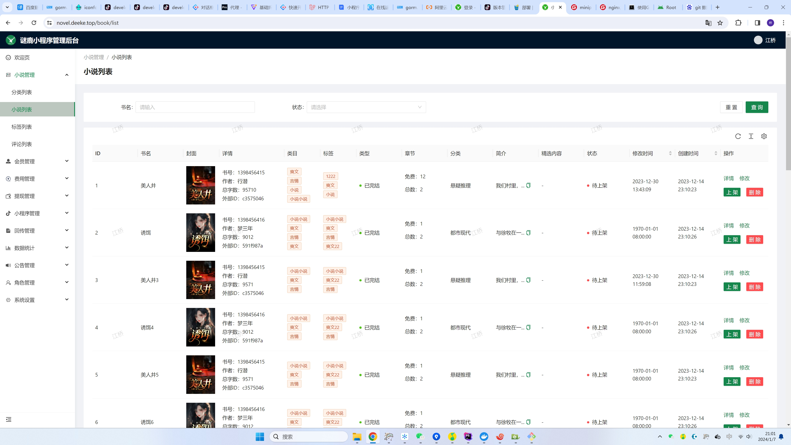

### 小程序展示
    小程序主要采用抖音小程序原生开发，性能更好。截图展示如下：

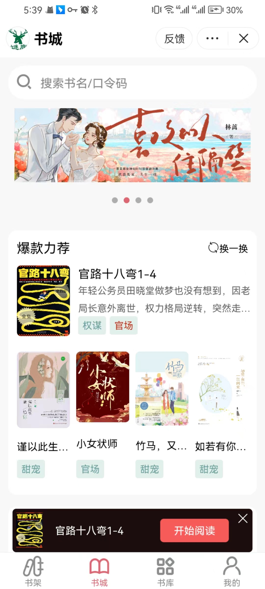
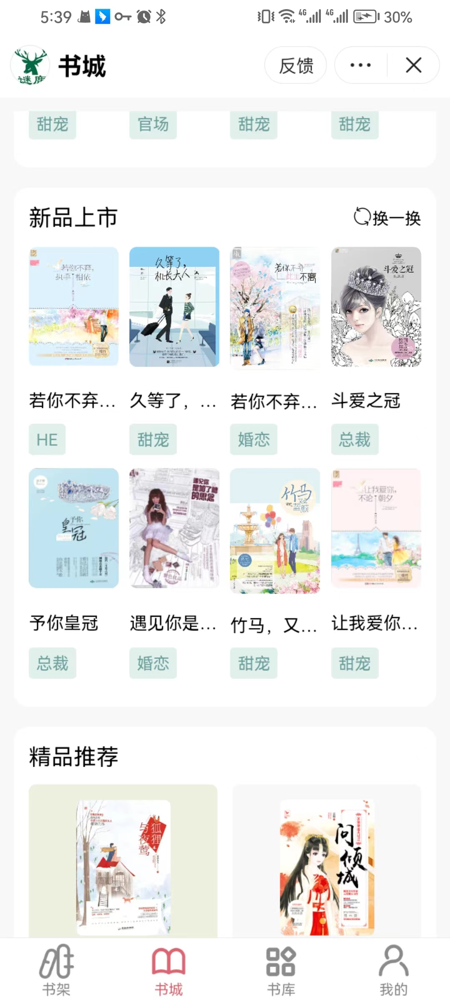
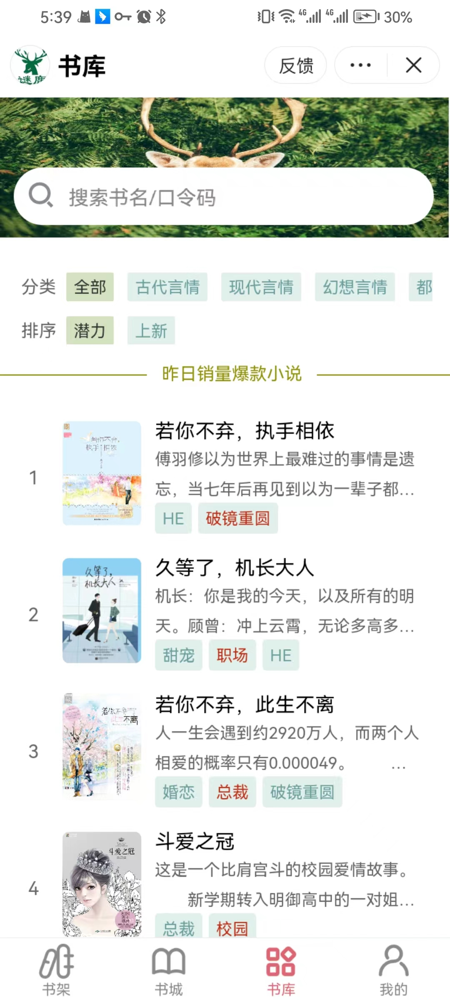
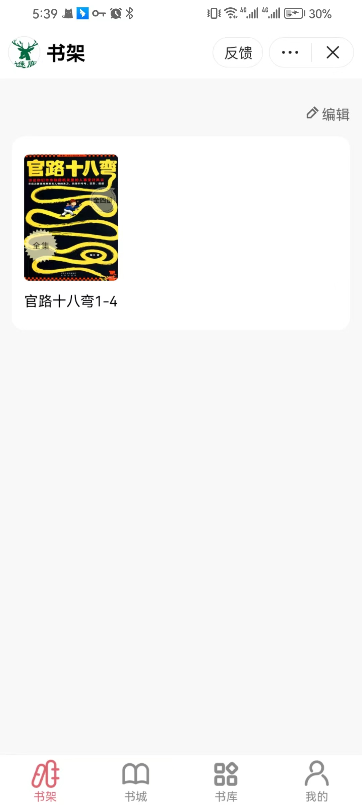
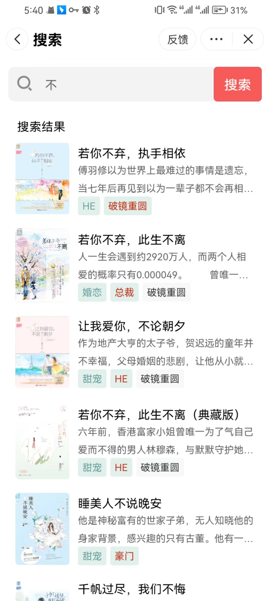
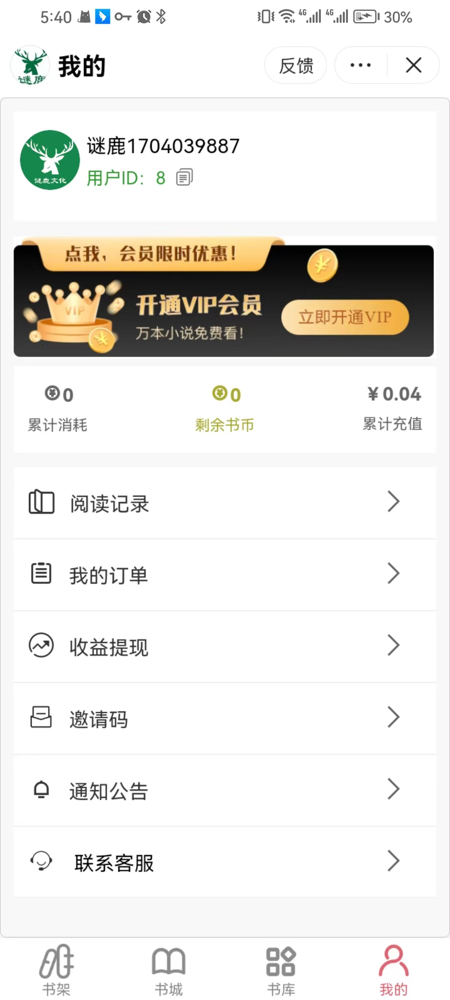
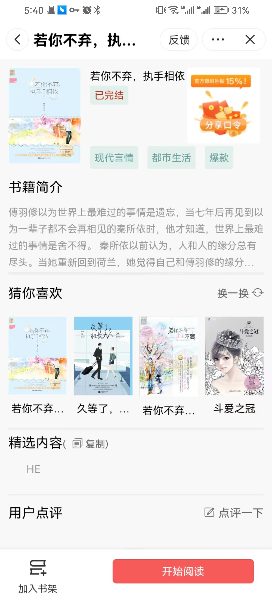
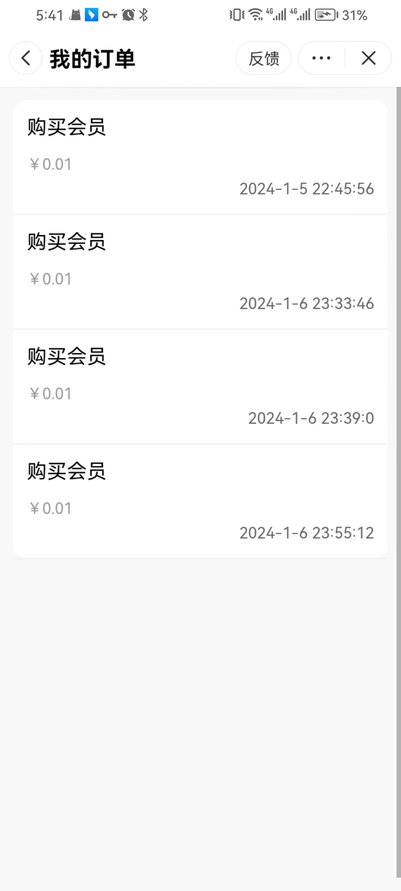
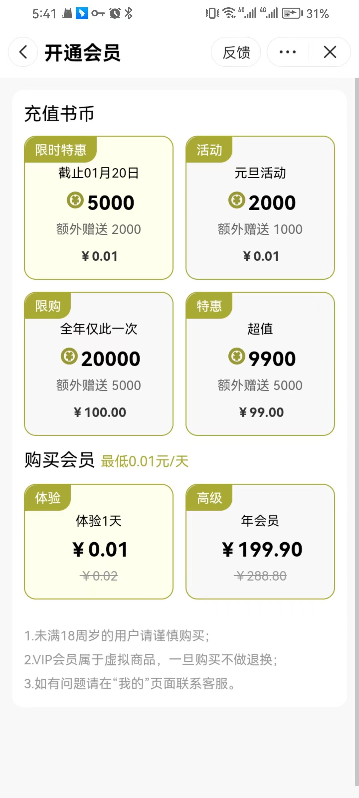
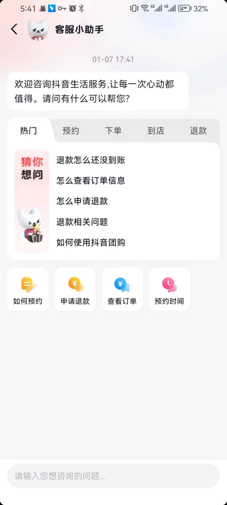
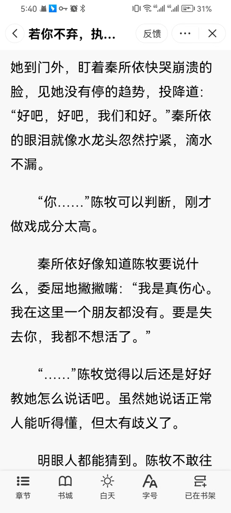
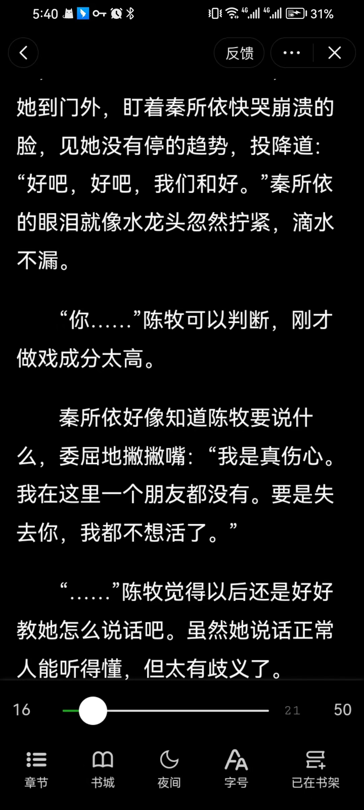
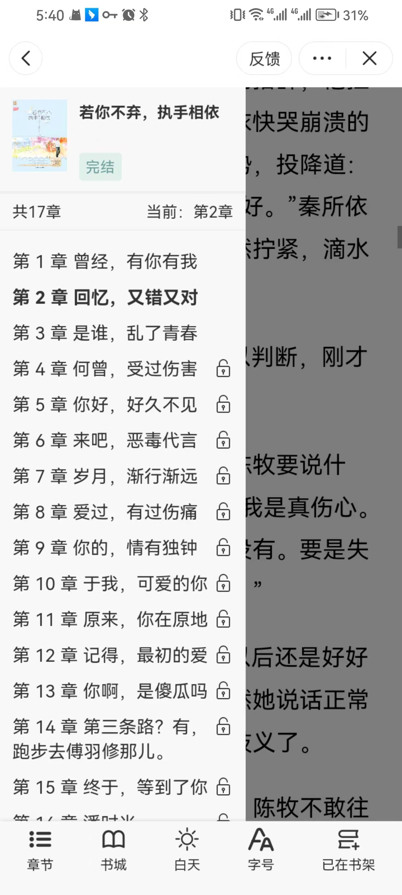
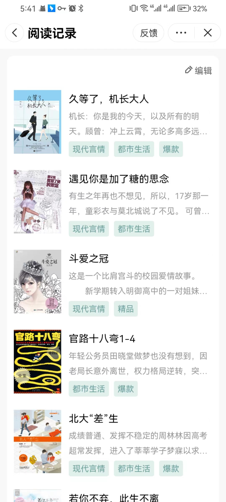

### 小程序接口
    小程序接口主要采用golang开发，因此在并发能方面的性能很好，更低的配置，支持更高的并发量
    小说主要采用的是阿里云的cos存储，加载速度更快

### 系统部署说明【需要源代码的请联系V：15807197051】
    系统核心文件夹架构如下：
        nginx
        mysql
           cert               Nginx的证书文件
           conf.d             nginx的配置文件，里面有一个配置文件可以作为参考
           html
              dist            后台页面文件（打包后的文件，需要源文件，请联系我本人）
              golang          小程序接口程序（这个是golang build之后的文件）
              lavavel         后台的接口，采用laravel框架开发（部分代码已加密）
              miniProgram     小程序源代码（非完整版）
        php                   PHP的配置文件
        redis                 Redis配置文件
        docker-compose.yaml  构建系统的核心文件

    接下来，请执行如下步骤：（下面的过程中可能会因为环境的不同出现不同的问题，需要自行解决，如果无法解决，请联系作者本人）
        1.下载docker
        2.获取本仓库代码
        3.填写各个配置文件【请阅读配置文件】
        4.进入docker-compose.yaml所在文件夹，执行：  docker compose up -d
        5.执行“docker ps -a”可以看到如下界面，nginx、PHP、golang、mysql、Redis都已启动

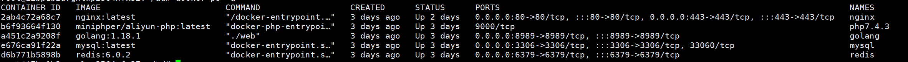

        6.如果各个配置都正确，这个时候访问你的域名，应该就能看到登录界面，如下：

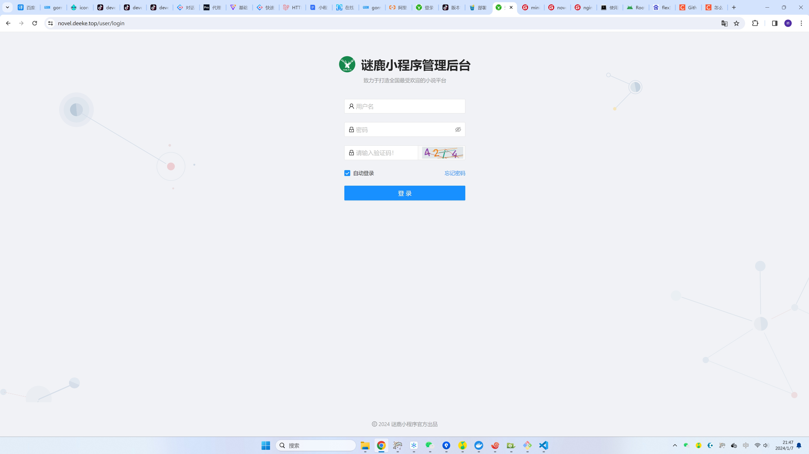

### 如果需要查看后台页面，请访问以下地址：
<a href="https://novel.deeke.top">https://novel.deeke.top</a>   账号：jiangqiao   密码：jiangqiao

### 配置文件
    主要有3个配置文件，分别是html/miniProgram里面的config.js文件：
        请将里面的地址baseUrl更改为你服务器的请求地址
    miniProgram文件夹下面的project.config.json文件：
        请修改里面的APPID，更改为你自己的小程序的appid
    miniProgram文件夹下面的app.js文件：
        请修改里面的globalData.setting.imageBaseUrl参数，把cos地址更改为你自己的地址

    请修改html/lavavel文件夹下面的.env文件，需要配置的变量如下：
        MINI_PROGRAM_APP_ID='你的小程序appid'
        MINI_PROGRAM_APP_SECRET='小程序的secret'

        #阿里云
        ALI_KEY=阿里云的key，用于cos的文件上传
        ALI_SECRET=阿里云的secret，用于cos文件上传
        BUCKET=jq-xiaoshuo 存储桶名称
        REGION=oss-cn-hangzhou 存储桶的地域
        ALI_IMAGES=images   存储图片的文件夹
        END_POINT=https://oss-cn-hangzhou.aliyuncs.com  cos地址，根据REGION参数调整即可
        #小说存放路径
        BOOK_DIR=book  存储小说的文件夹
        BOOK_IMAGE_DIR=book_image  存储小说的图片文件夹

    请修改html/golang文件夹下面的config.ini文件：
        主要配置[douyin]和[ali]标识下面的内容即可，其中[ali]下面的内容参考.env（上面）的配置即可；
        [douyin]下面的参数，都是根据小程序开发提供的参数，需要自己在抖音开放平台寻找即可

### 目前抖音小说小程序已经有线上案例，有需要请联系商务：

### 本程序由8年资深软件工程师开发【团队正在招募一些有业余时间的软件工程师（PHP，Python，Golang，Android，IOS，JavaScript，逆向工程师等）共图大业~】：

